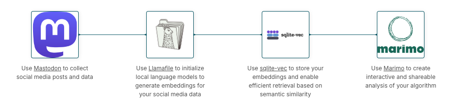

# Build your own local social media algorithm

This blueprint guides you through building your own personalized social media algorithm from scratch using open-source tools. It leverages local language models, efficient vector storage, and advanced retrieval techniques—all running locally on your machine. Follow this Blueprint to collect, analyze, and visualize your data, enabling you to build a social media algorithm that you control and trust.

